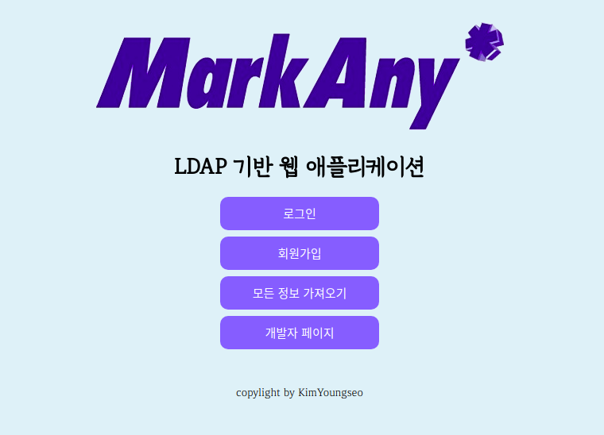

LDAP Client API for Web Application
=============
OpenLDAP 을 기반으로 한 클라이언트 API 입니다
http://www.openldap.org/

## LDAP
* 디렉토리 서비스를 위한 프로토콜
* 경량화 된 DAP 

## 기술스택
### Client
* LDAP JS (npm)
* EJS (templete Engine)
### Server
* Docker
  * https://github.com/osixia/docker-openldap
  * https://github.com/osixia/docker-phpLDAPadmin
* Node JS
### DB
* MySQL

## API
객체 응답 결과는 JSON , HTML 이다.

```js

USER : 유저
OU : 조직
GROUP : 그룹
ADMIN : 어드민
ORG : 최상위조직
OTHER : 전체

#User

GET /user
GET /user/:cn
GET /user/:cn/web
GET /user/add/web
POST /user/add
POST /user/bind
PUT /user/password
DELETE /user/:cn

#Ou
GET /ou
GET /ou/:ou
GET /ou/:ou/web
POST /ou/add
DELETE /ou/:ou

#Group
GET /group
GET /group/:cn
GET /group/:cn/web
POST /group/add
DELETE /group/:cn

#Admin
GET /admin
GET /admin/:cn
GET /admin/:cn/web

#Org
GET /org
GET /org/:dc
GET /org/:dc/web

#Other
GET /other
GET /other/web
```

## View

